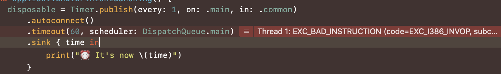

## Overview

When using Combine's [timeout](https://developer.apple.com/documentation/combine/anypublisher/3204263-timeout) operator on watchOS, the application will immediately crash regardless of options provided.




The code example: 

```swift
var cancellable = Timer.publish(every: 1, on: .main, in: .common)
  .autoconnect()
  .timeout(60, scheduler: DispatchQueue.main) // <- Problem
  .sink { time in
      print("⏰ It's now \(time)")
  }
```


### Experimenting with Queues

Attempting to create use DispatchQueue with any combination of options also causes the crash:

```swift
var queue = DispatchQueue(label: "CustomQueue")

func applicationDidFinishLaunching() {
    disposable = Timer.publish(every: 1, on: .main, in: .common)
        .autoconnect()
        .timeout(60, scheduler: queue)
        .sink { time in
            print("⏰ It's now \(time)")
        }
}
```


### Tested Devices

- watchOS simulator (Xcode 11.4.1)
- Apple Watch Series 3, watchOS 6.x.x